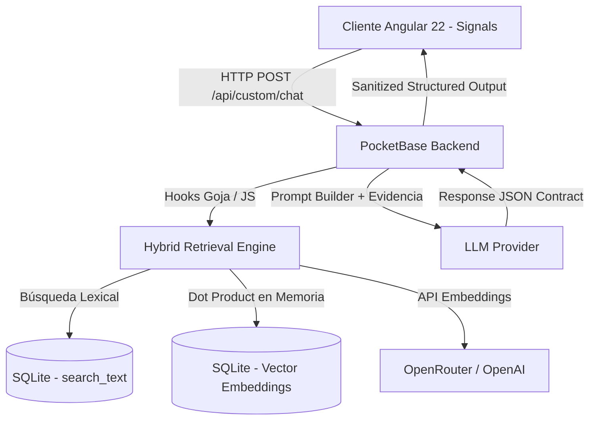

# 🚀 Anthony Smith's Portfolio & RAG AI Chatbot

[](https://angular.dev/)
[](https://pocketbase.io/)
[](https://www.typescriptlang.org/)
[](LICENSE)

Este repositorio contiene la plataforma web personal y portafolio interactivo de **Anthony Smith Victoria Godínez**. El proyecto destaca por integrar una interfaz de usuario ultra-fluida en el frontend y un motor RAG (Retrieval-Augmented Generation) autónomo en el backend para dar soporte a un asistente de IA conversacional especializado.

---

## 🏗️ Arquitectura y Stack Tecnológico

El proyecto está diseñado bajo una filosofía de **bajo consumo de recursos y alta mantenibilidad**, ideal para despliegues en servidores VPS económicos (e.g., DigitalOcean de $6 USD/mes) sin necesidad de contenedores pesados ni bases de datos vectoriales dedicadas (como ChromaDB o Python en servidor).



### 1. Frontend: Angular 22
*   **Standalone Components:** Arquitectura modular sin módulos innecesarios.
*   **Signals Paradigm:** Estado reactivo basado enteramente en `signal`, `computed`, `effect`, `input` y `output` para interfaces reactivas de alto rendimiento.
*   **Google Stitch Baseline:** Diseño visual moderno y pulido con soporte para transiciones suaves, *Glassmorphism* y animaciones ligeras.

### 2. Backend: PocketBase (v0.22.x)
*   **Base de datos embebida:** SQLite de alto rendimiento integrado.
*   **Hooks Goja (JS/ES6):** Toda la lógica de negocio y APIs del chatbot están programadas directamente en JavaScript dentro de `pb_hooks/`.
*   **Migraciones Idempotentes:** Cambios de base de datos y seeds de información gestionados a través de `pb_migrations/`.

### 3. Motor RAG & Chatbot
*   **Vectorización Automática:** Hooks automáticos vectorizan contenidos de la base de conocimientos y portafolio al ser creados o modificados.
*   **Recuperación Híbrida:** Búsqueda combinada (Lexical Overlap + Similitud de Coseno en vectores normales) en SQLite directamente desde Goja.
*   **Seguridad Activa:** Validador de inyecciones de prompts, aislamiento de contexto `<contexto>` e instrucciones del sistema inmutables.
*   **Contrato JSON Estricto:** Validación rigurosa de respuestas estructuradas del LLM.

---

## 📁 Estructura del Proyecto

```text
├── pb_hooks/                  # Lógica del servidor (PocketBase Goja hooks)
│   ├── main.pb.js             # Enrutamiento de endpoints y hooks de eventos
│   └── _starklab_helpers.js   # Algoritmos RAG, embeddings, rate limits e IA
├── pb_migrations/             # Migraciones y Seeds de datos
│   ├── 20260618150000_...     # Migración de esquemas iniciales
│   └── 20260623000000_...     # Seed de datos e historial de Anthony Smith
├── pb_public/                 # Frontend compilado para producción
├── src/                       # Código fuente de Angular 22
│   ├── app/
│   │   ├── core/              # Modelos y servicios (servicios de chat y PB)
│   │   ├── features/          # Componentes de páginas y widgets (Chat, Landing)
│   │   └── shared/            # Componentes reutilizables de UI
│   └── environments/          # Configuración de entornos de Angular
├── .env.example               # Plantilla de variables de entorno
├── LICENSE                    # Licencia MIT del proyecto
├── package.json               # Dependencias del Frontend
└── start_pb.cjs               # Script Node para inyectar .env y arrancar PB
```

---

## 🛠️ Requisitos Previos

Antes de arrancar, asegúrate de tener instalado:
*   **Node.js**: Versión `v22.22.3` / `v24.15.0` o superior (Recomendado: `v24.17.0+`).
*   **PocketBase**: El binario ejecutable (`pocketbase` o `pocketbase.exe`).
    *   *Nota:* Descarga el binario correspondiente a tu sistema operativo desde [pocketbase.io/docs/](https://pocketbase.io/docs/) y colócalo en la raíz del repositorio.

---

## ⚙️ Configuración Paso a Paso

### 1. Variables de Entorno
Copia la plantilla de variables de entorno locales:
```bash
cp .env.example .env
```
Abre el archivo `.env` y edita las siguientes propiedades con tus credenciales:
*   `OPENROUTER_API_KEY`: API Key de OpenRouter.
*   `GROQ_API_KEY`: API Key de Groq.
*   `EMBEDDING_API_KEY`: API Key para embeddings (e.g. OpenAI o similar).
*   `EMBEDDING_API_BASE_URL`: Endpoint de embeddings (ej. `https://openrouter.ai/api/v1` o `https://api.openai.com/v1`).
*   `TURNSTILE_SECRET_KEY`: Llave secreta del captcha de Cloudflare (la llave de pruebas local `1x0000000000000000000000000000000AA` viene configurada por defecto).

### 2. Base de Datos & Migraciones (PocketBase)
Para arrancar PocketBase inyectando las variables de entorno locales de tu archivo `.env`, ejecuta en tu terminal:
```bash
node start_pb.cjs
```
> **Nota:** Al iniciar por primera vez, PocketBase aplicará automáticamente todas las migraciones acumuladas en `pb_migrations/`. Esto creará el esquema de base de datos y sembrará los registros reales de Anthony Smith de manera **idempotente**.

*   **Panel de Administración:** Accede en [http://127.0.0.1:8090/_/](http://127.0.0.1:8090/_/) y crea tu usuario Administrador inicial.
*   **Configuración del Asistente:** En la colección `config_app`, puedes ajustar temperaturas de generación, el proveedor activo (`groq` u `openrouter`), el modelo del chatbot y el modelo de embeddings.

### 3. Levantar Cliente (Angular 22)
Instala las dependencias y arranca el servidor de desarrollo local del cliente:
```bash
npm install
npm start
```
Abre tu navegador en [http://localhost:4200](http://localhost:4200). ¡El widget de chat estará disponible de forma interactiva en la esquina inferior derecha!

---

## 🔄 Reindexación de Embeddings

Los registros sembrados se inicializan en estado `"pending"` para no retrasar la migración local. Para forzar la generación vectorial de todas tus bases de conocimiento o proyectos:

1.  Asegúrate de que PocketBase esté corriendo a través de `node start_pb.cjs` (para tener las variables de entorno de tu `.env` cargadas).
2.  Envía una petición HTTP POST al endpoint de reindexación como Superusuario (requiere cabecera de autenticación de admin):
    ```http
    POST /api/custom/reindex
    Content-Type: application/json
    Authorization: Admin <Token>
    
    {
      "collection": "knowledge_base",
      "limit": 25
    }
    ```
Los hooks de actualización automáticos llamarán a la API de embeddings y guardarán el resultado vectorizado en tu SQLite local en cuestión de segundos.

---

## 🔒 Seguridad del Endpoint Chatbot

El endpoint expuesto en `/api/custom/chat` incluye una capa robusta de defensas programada en los hooks:
1.  **Rate Limiting:** En memoria en base a ventana temporal y número máximo de peticiones por hash de IP y sesión.
2.  **Anti-Jailbreak y Aislamiento:** Inyección del contexto del RAG encapsulado de forma estricta. El sistema le instruye explícitamente al LLM ignorar comandos encontrados dentro de los fragmentos recuperados.
3.  **Validación de Salida Estricta:** Si el modelo genera texto libre o rompe el formato estructurado del contrato JSON, la respuesta es descartada a favor de un *fallback seguro* controlado en el servidor.

---

## 📝 Licencia

Este proyecto está bajo la Licencia **MIT**. Consulta el archivo [LICENSE](LICENSE) para obtener más información.
